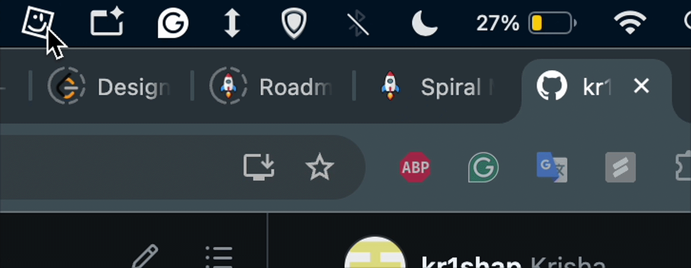
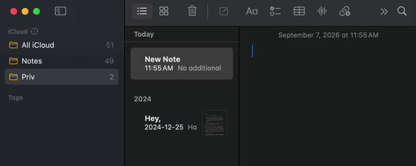
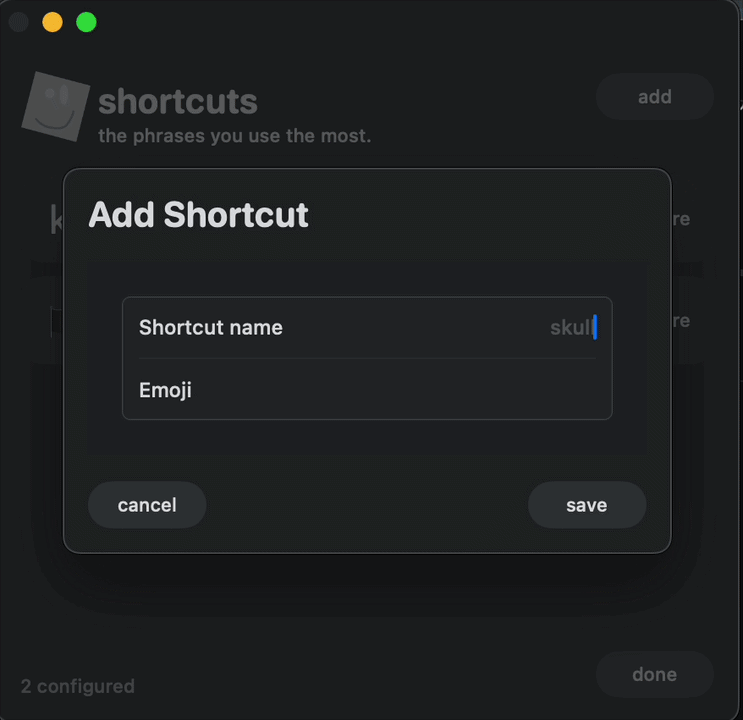

#  moji

<table>
	<tr>
		<td></td>
		<td></td>
	</tr>
	<tr>
		<td colspan="2" align="center"></td>
	</tr>
</table>

> A thoughtful little macOS companion for turning your custom emoji shortcodes into emoji—right where you type.

If you use the same emojis all the time, Moji saves you from opening the emoji picker over and over. Add a shortcut such as `skull` → `💀`, then type `:skull:` in a supported text field and Moji swaps it in for you.

It lives quietly in your menu bar. Set up your shortcuts once, turn it on, and keep typing as usual.

---

## Version 1 · Current release

V1 is intentionally focused: reliable, user-defined emoji replacement without unnecessary ceremony.

### What’s included

- A native menu-bar experience with a dedicated shortcut-management window.
- Create, edit, delete, enable, and disable custom `:alias:` → emoji shortcuts.
- Persistent shortcuts that are validated and normalized before saving.
- An in-memory runtime index for fast lookup while typing.
- Global shortcode detection while Moji is enabled and macOS input access is available.
- Careful handling of malformed aliases, backspace, navigation keys, modifiers, repeated keys, and timeouts.
- Replacement through synthesized Backspaces and a temporary clipboard paste, with best-effort clipboard restoration afterward.

### Intentionally out of scope

V1 does not include a built-in emoji library, imports, favorites, launch at login, autocomplete, or suggestions.

---

## Version 2 · In exploration

V2 will make Moji more assistive while preserving the simplicity of the core experience.

- **Autocomplete and suggestions** while an alias is being typed.
- Better discovery, browsing, and management for larger shortcut collections.
- Further refinement of replacement behavior, compatibility, and settings. aka. bug issues
- On the technical end, clean up the code!
- Refine for liquid glass (when I get a new macbook!)

> These are planned directions, not committed release scope or dates.

---

## Built with

| Technology                    | Purpose                                                            |
| ----------------------------- | ------------------------------------------------------------------ |
| **Swift + SwiftUI**           | Native macOS application and menu-bar interface                    |
| **SwiftData**                 | Durable shortcut storage                                           |
| **Core Graphics (`CGEvent`)** | Keyboard observation and replacement keystrokes                    |
| **AppKit**                    | macOS integrations, including the pasteboard and menu-bar behavior |
| **Swift Testing + XCTest**    | Unit and UI coverage                                               |

---

## A note on keyboard events

Moji uses an active, session-level Core Graphics event tap to observe key-down events—but only while the feature is enabled. macOS input-access permissions are required before the tap can run.

Each event is normalized and passed to a small shortcode state machine. It retains only the current, bounded candidate—such as `:skull:`—and never stores surrounding document text. When the final colon completes a configured alias, Moji suppresses that one keystroke, posts the required Backspaces, pastes the emoji, and makes a best-effort attempt to restore the previous clipboard contents. All other input passes through normally.

Moji also marks its own synthesized events to avoid processing them again, and re-enables the event tap if macOS temporarily disables it.

> **Clipboard note:** clipboard managers may briefly observe Moji’s temporary emoji value during replacement.

> **Entitlements note:** Moji does not use the App Sandbox. That entitlement was removed because the sandbox prevents the reliable global `CGEvent` tap and synthesized keyboard events required for shortcode detection and replacement. Hardened runtime and automatic code signing remain enabled, and macOS input-access permissions are still required.

> **Project.pbxproj:** If you look at this file, you probably will see my name as the workspace (as well, I created the project locally). You can change this to yours if you want to play around, it should do no harm.

### Keyboard input data flow


---

## Getting started

1. Launch Moji and choose **Manage Shortcuts** from the menu-bar icon.
2. Add an alias and an emoji—for example, `party` and `🎉`.
3. Select the requested **Accessibility** permission in Moji and approve the native macOS prompt. If it was previously denied, enable Moji manually under **Privacy & Security** → **Accessibility**. When System Settings asks to quit and reopen Moji so the permission can take effect, choose **Quit & Reopen**.
4. Type `:party:` in a text field to insert `🎉`.

### Launching without opening Xcode

On a Mac with Xcode or the Xcode Command Line Tools installed, double-click [`launch-moji.command`](launch-moji.command). Or, run `./launch-moji.command`.

The script builds the Release app using Xcode’s normal signing, stops an older Moji instance, and launches the newly built app. Stable signing is necessary because macOS associates Accessibility grants with the app’s signing identity; ad-hoc signatures change whenever the executable changes and invalidate those grants.

Select your own development team in the project’s **Signing & Capabilities** settings before using the launcher. You can also override the project setting for one invocation:

```zsh
MOJI_DEVELOPMENT_TEAM=YOUR_TEAM_ID ./launch-moji.command
```

A free Apple developer account is sufficient for local development. The launcher does not require the project owner’s account. On the first signed launch, select Moji’s permission buttons and approve the native macOS prompts.

If this Mac previously granted access to an ad-hoc or differently signed Moji build, reset those stale entries once before granting access to the newly signed build:

```zsh
MOJI_BUNDLE_ID="$(/usr/libexec/PlistBuddy -c 'Print :CFBundleIdentifier' .build/Build/Products/Release/moji.app/Contents/Info.plist)"
tccutil reset Accessibility "$MOJI_BUNDLE_ID"
```

This is a local development launcher, not a notarized app distribution method.

> **Why Moji?** It is a small utility for a tiny everyday annoyance. No new keyboard to learn—just your own shortcuts, available wherever you type.
